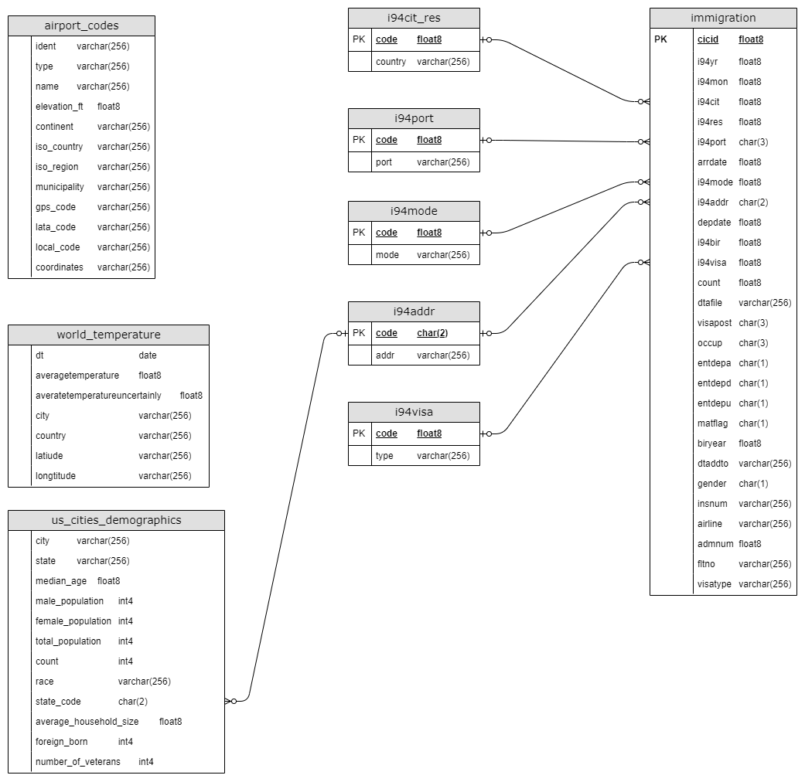
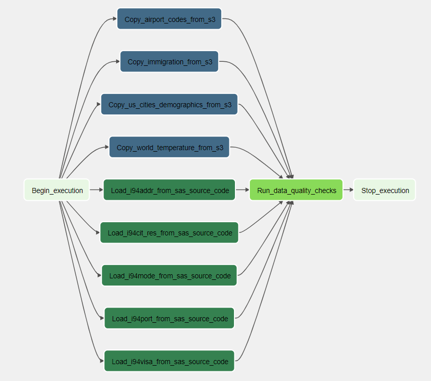

# Udacity Data Engineering Nanodegree Capstone Project

## Overview

This project will build a data pipelines that manages an analytics database for querying information about I94 immigration, world temperature, city demographic and airport code. The analytics tables are hosted in AWS Redshift and the data pipelines are implemented using Apache Airflow.

## Datasets

The following datasets were used to create the analytics database:

- **I94 Immigration Data**: This data comes from the US National Tourism and Trade Office found [here](https://travel.trade.gov/research/reports/i94/historical/2016.html). Each report contains international visitor arrival statistics by world regions and select countries (including top 20), type of visa, mode of transportation, age groups, states visited (first intended address only), and the top ports of entry (for select countries).
- **World Temperature Data**: This dataset came from Kaggle found [here](https://www.kaggle.com/berkeleyearth/climate-change-earth-surface-temperature-data).
- **U.S. City Demographic Data**: This dataset contains information about the demographics of all US cities and census-designated places with a population greater or equal to 65,000. Dataset comes from OpenSoft found [here](https://public.opendatasoft.com/explore/dataset/us-cities-demographics/export/).
- **Airport Code Table**: This is a simple table of airport codes and corresponding cities. The airport codes may refer to either IATA airport code, a three-letter code which is used in passenger reservation, ticketing and baggage-handling systems, or the ICAO airport code which is a four letter code used by ATC systems and for airports that do not have an IATA airport code (from wikipedia). It comes from [here](https://datahub.io/core/airport-codes#data).

## Data Model

The data model consists of tables

- immigration
- us_cities_demographics
- airport_codes
- world_temperature
- i94cit_res
- i94port
- i94mode
- i94addr
- i94visa



## Data Pipeline



## Usage

1. Install Python 3 and Docker

2. Fill AWS Redshift connection and S3 target bucket endpoint in `dwh.cfg`

3. Create tables

   ```
   python3 create_tables.py
   ```

4. Set the right Airflow user

   ```
   mkdir -p ./dags ./logs ./plugins
   echo -e "AIRFLOW_UID=$(id -u)" > .env
   ```

5. Initialize the database for Airflow

   ```
   docker compose up airflow-init
   ```

6. Running Airflow

   ```
   docker-compose up
   ```

7. Access Airflow UI at `http://localhost:8080`

8. Create AWS connection and Redshift connection

9. Run `capstone_dag` in Airflow UI
